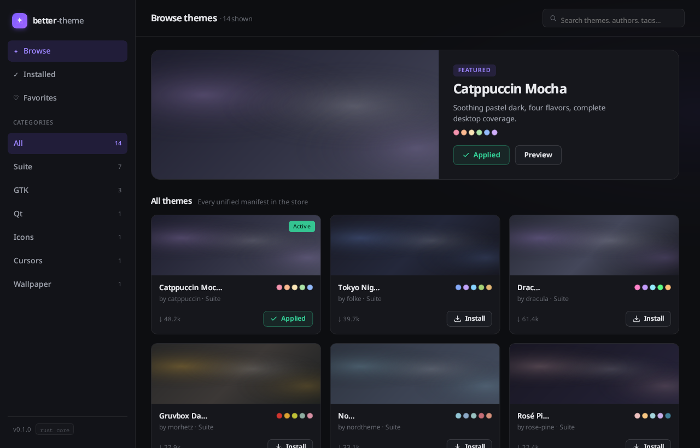

# LinuxThemer

> 🚧 **EARLY ALPHA — under active development.**
> Most features are placeholders or only partially implemented. Do not expect a
> stable, complete theme manager yet — this is a work in progress.

A modern Linux theme manager for **KDE Plasma**: browse, preview, install, and
apply themes from KDE-Look — global themes, icons, cursors, window decorations,
color schemes, SDDM login themes, wallpapers, and more — in a clean dark UI.



## Status

**Alpha / pre-release.** The scaffold and the preview engine work; the rest is
being built out.

| Area | State |
| --- | --- |
| Browse KDE-Look catalog | ✅ working |
| System-wide installed-theme scan | ✅ working |
| Per-kind previews (cursors, icons, colors, decorations) | ✅ working |
| Apply themes | ⚠️ partial |
| Download + install | ⚠️ partial |
| Settings (accent, theme dropdowns) | ⚠️ partial |
| Studio (theme assembler) | 🚧 placeholder |
| Favorites | 🚧 placeholder |

## Features so far

- **Browse** KDE-Look's full catalog (icons, cursors, GTK, SDDM, wallpapers,
  decorations, global themes, plasma themes, …)
- **Installed** — system-wide scan grouped by category, with rich per-kind previews:
  - **cursors** → real rendered cursor shapes (native Xcursor decoder in Rust)
  - **icons** → sample icon grid
  - **color schemes / GTK** → palette mock windows
  - **window decorations** → window mockups with the theme's real titlebar buttons
  - **global / plasma / SDDM / wallpapers** → on-disk preview images
- **Settings** — per-component theme dropdowns + accent color picker

## Tech stack

- **Tauri 2** (Rust backend) + **React + TypeScript + Vite** (frontend)
- Rust engine: theme scanning/apply, Xcursor decoding, SVG/video rasterization
  via ffmpeg, KDE config read/write (with `kdedefaults` merge)

## Development

```bash
npm install
npm run tauri dev
```

Requires Rust, Node 22, and the Tauri v2 toolchain. Linux-only — targets KDE
Plasma (Kubuntu tested).

## License

[MIT](LICENSE)
